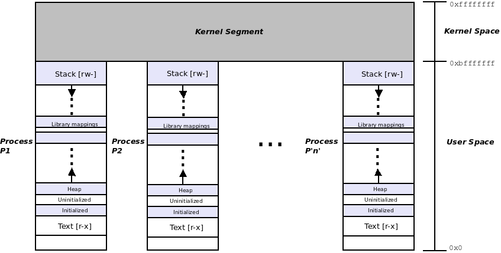

# Section 2: Understanding and Working with the Kernel

- [Kernel Internals Essentials - Processes and Threads](#kernel-internals-essentials---processes-and-threads)
- [Memory Management Internals - Essentials](#memory-management-internals---essentials)
- [Kernel Memory Allocation for Module Authors - Part 1](#kernel-memory-allocation-for-module-authors---part-1)

## Kernel Internals Essentials - Processes and Threads

- 다루는 주제
  - 프로세스 및 인터럽트 컨텍스트 이해
  - VAS(가상 주소 공간) 프로세스의 기본 이해
  - 프로세스, 스레드 및 스택 구성 - 사용자 및 커널 공간
  - 커널 작업 구조 이해 및 접근

### Understanding process and interrupt contexts

- Process context - 프로세스나 스레드의 system call이나 processor exception에 의해 커널 모드로 전환하고 커널 데이터에서 작동, 커널 코드 실행은 프로세스 또는 스레드에서 실행synchronous(top down)
- Interrupt context - 하드웨어 인터럽트 발생시 커널 모드에서 코드를 실행, asynchronous(bottom up)
- 

### Understanding the basics of the process VAS

- VAS는 segment라고 불리는 메모리 리전으로 나눠져 있음

- segment 분류
  - Text segment : machine code
  - Data segment(s) : global and static data variables
    - Initialized data segment
    - Uninitialized data segment
    - Heap segment : 메모리 할당 및 해제를 위한 라이브러리 API
  - Libraries(text, data) : 프로세스가 동적으로 링크하는 모든 공유 라이브러리는 프로세스 VAS에 매핑
  - Stack : parameter passing, local variable instantiation, return value propagation
- 프로세스에는 최소한 하나의 실행 스레드가 포함되어야 함

### Organizing processes, threads, and their stacks - user and kernel space

- 스레드는 프로세스 내의 실행 경로
- 스레드는 스택을 제외하고 user VAS를 포함한 모든 프로세스 리소스를 공유
- 모든 스레드에는 전용 스택 영역이 존재

- 커널 스레드를 포함한 모든 스레드는 task structure라는 kernel metadata structure에 매핑
- 모든user space thread에는 두 개의 스택이 존재
  - A user space stack
  - A kernel space stack : 스레드가 system call을 통해 커널 모드로 전환하고 프로세스 컨텍스트에서 커널 코드 경로를 실행할 때 작동
- 

- 현재 돌고 있는 쓰레드와 프로세스의 수를 볼 수 있는 스크립트
  - `ch6/countem.sh`

#### User space organization

- User segment
  - Text: Code
  - Data segment
  - Library mappings
  - Downward-growing stack(s)
- user thread에 대해 하나의 user stack이 존재
  - user space stack은 항상 main() 스레드에 대해 존재하며 VAS의 최상단에 위치
  - 다중 스레드인 경우 활성 스레드당 하나의 user mode thread stack이 존재
    - 리눅스의 pthread_create 라이브러리 API는 clone system call을 호출
    - 이 system call은 _do_fork()를 호출하고 전달된 clone_flags 매개변수는 커널에게 스레드를 생성하라고 알려줌
  - user space stack은 동적

#### Kernel space organization

- user mode thread에는 두 개의 stack이 존재

  - 하나는 user mode stack이고 다른 하나는 kernel mode stack

- kernel mode stack 특성

  - main()을 포함하여 각 응용 프로그램 스레드에 대해 하나의 kernel mode stack이 존재
  - kernel mode stack은 크기가 static, 매우 작음

  - 스레드 생성 시 할당

- 커널 스레드에는 kernel mode stack만 존재

#### Viewing the user and kernel stacks

- 스택은 디버그의 핵심
  - 스레드의 호출 스택을 보고 해석

##### Traditional approach to viewing the stacks

- 전통적인 접근 방식으로 프로세스 또는 스레드의 커널 및 사용자 모드 스택을 보는 방법

- kernel space stack 확인

  - `proc` 파일 시스템 인터페이스를 통해 확인

  - `/proc/<pid>/stack`

  - bash 프로세스의 pid를 3085라고 가정

  - ```sh
    $ sudo cat /proc/3085/stack
    [<0>] do_wait+0x1cb/0x230
    [<0>] kernel_wait4+0x89/0x130
    [<0>] __do_sys_wait4+0x95/0xa0
    [<0>] __x64_sys_wait4+0x1e/0x20
    [<0>] do_syscall_64+0x5a/0x120
    [<0>] entry_SYSCALL_64_after_hwframe+0x44/0xa9
    ```

    - bottom-up으로 읽어야 함
    - 각 출력 라인은 호출 프레임을 나타냄
    - ??라고 나오는 함수 이름은 무시

- user space stack 확인

  - `gstack`을 이용해 확인

    - 배치 모드에서 gdb를 호출하여 gdb가 backtrace 명령을 호출하도록 하는 스크립트에 대한 간단한 래퍼

  - ```sh
    $ gstack 12696
    #0 0x00007fa6f60754eb in waitpid () from /lib64/libc.so.6
    #1 0x0000556f26c03629 in ?? ()
    #2 0x0000556f26c04cc3 in wait_for ()
    #3 0x0000556f26bf375c in execute_command_internal ()
    #4 0x0000556f26bf39b6 in execute_command ()
    #5 0x0000556f26bdb389 in reader_loop ()
    #6 0x0000556f26bd9b69 in main ()
    ```

##### [e]BPF - the modern approach to viewing both stacks

- BDF라는 기술을 이용한 방법

- stackcount라는 BCC 도구를 이용

  - 커널과 사용자 모드 스택을 동시에 제공

- stackcount는 함수를 지정해야 하며 함수는 user space와 kernel space의 함수 모두 가능

  - malloc을 포함하는 함수 조회

  - `$ sudo stackcount-bpfcc -p 29819 -r ".*malloc.*" -v -d`

    > [e]PDF 프로그램은 kernel lockdown 기능으로 인해 실패할 수 있음, 기본적으로는 비활성화

  - `-d` 옵션은 구분 기호를 출력, 프로세스의 kernel mode stack과 user mode stack의 경계를 나타냄

- Hello, world 프로그램 예제

  - 코드는 `ch6/ebpf_stacktrace_eg/`

  - ```
    $ make
    $ ./runit.sh
    ```

#### The 10,000-foot view of the process VAS


### Understanding and accessing the kernel task structure
- 모든 단일 사용자 및 커널 공간 스레드는 Linux 커널 내에서 모든 속성을 포함하는 메타데이터 구조(task struct)로 표현
- 
  - task structure는 시스템에 있는 모든 프로세스/스레드에 관한 정보를 보유
  - 특정 속성은 fork시 자식 프로세스나 스레드에 상속

#### Looking into the task structure

- task structure는 프로세스 또는 스레드의 '루트' 데이터 구조
  - 이 구조는 작업의 모든 속성을 보유
- task structure는 `include/linux/sched.h`에 정의되어 있음

#### Accessing the task structure with current

- `countem.sh` 실행 결과 총 1,234개의 스레드가 존재했음

  - 이는 커널 메모리에 총 1,234개의 task structure objects가 있음을 의미

- 커널이 필요할 때 쉽게 task structure에 접근할 수 있어야함

  - 따라서 커널 메모리의 모든 task structure objects는 task list라고 하는 circular doubly linked list에 연결됨

- 프로세스 또는 스레드가 커널 코드를 실행할 때 커널 메모리에 존재하는 수천개 중 어떤 task struct가 자신에 속하는지 어떻게 찾는가?

  - `current`라는 매크로 이용
    - `current`를 사용하면 현재 커널 코드를 실행 중인 스레드의 task_struct에 대한 포인터가 생성됨, 특정 프로세서 코어에서 현재 실행 중인 프로세스 컨텍스트
    - `current`는 객체 지향 언어에서 `this` 포인터를 호출하는 것과 유사

  - `current`는 구현이 빠르도록 설계, O(1)

  - `current`를 이용해 tsak structure를 역참조하고 정보를 추출

    ```c
    #include <linux/sched.h>
    current->pid, current->comm
    ```

#### Determining the context

- 커널 코드는 다음 두 컨텍스트 중 하나에서 실행

  - Process (or task) context
  - Interrupt (or atomic) context

- 코드를 작성할 때 작업 중인 코드가 실행 중인 컨텍스트를 파악하는 방법

  ```c
  #include <linux/preempt.h>
  in_task()
  ```
  - True면 프로세스 컨텍스트에서 실행 중
  - False면 인터럽트 컨텍스트에서 실행 중

### Working with the task structure via current

- task structure의 몇 가지 멤버를 표시하고 init 및 cleanup 코드 경로가 실행되는 프로세스 컨텍스트를 표시하는 간단한 커널 모듈

  - `ch6/current_affairs/current_affairs.c`

  - `current`를 사용하여 접근하는 `show_ctx()` 함수를 사용

  - 현재 포인터를 역참조하여 다양한 task_struct 멤버에 액세스하고 이를 표시함

    ```c
    if (likely(in_task())) {
    	pr_info(
    	"%s: in process context ::\n"
    	" PID : %6d\n"
    	" TGID : %6d\n"
    	" UID : %6u\n"
    	" EUID : %6u (%s root)\n"
    	" name : %s\n"
    	" current (ptr to our process context's task_struct) :\n"
    	" 0x%pK (0x%px)\n"
    	" stack start : 0x%pK (0x%px)\n",
    	nm,
    	/* always better to use the helper methods provided */
    	task_pid_nr(current), task_tgid_nr(current),
    	/* ... rather than the 'usual' direct lookups:
    		current->pid, current->tgid, */
    	uid, euid,
    	(euid == 0?"have":"don't have"),
    	current->comm,
    	current, current,
    	current->stack, current->stack);
    }
    ```

#### Built-in kernel helper methods and optimizations
- `task_pid_nr`
- `from_kuid`
- `in_task()`
- `like()/unlikely()`

#### Trying out the kernel module to print process context info

- `current_affair.ko`를 빌드하고 커널에 적재

  ```
  $ sudo insmod ./current_affairs.ko ; dmesg
  $ sudo rmmod current_affairs ; dmesg | tail
  ```

  - 코드를 실행하는 프로세스 컨텍스트의 프로세스 확인 가능

##### Seeing that the Linux OS is monolithic

- `insmod` 프로세스 자체가 프로세스 컨텍스트에서 실행했기 때문에 Linux 커널의 모놀리식 특성 입증

- 하지만 Linux 커널은 모놀리식으로 간주되지 않음, Linux는 모듈화를 지원

##### Coding for security with printk

- `ch6/current_affairs/current-affairs.c`에서 `%pK`라는 형식 지정자 사용
  - 이는 보안을 위해 사용
  - 커널 정보가 누출되지 않도록 함

### Iterating over the kernel's task lists

- list data structure는 circular doubly linked list를 사용
  - 여기서 작동하는 핵심 커널 코드는 `List.h`
- `include/linux/sched/signal.h` 파일에서 제공된 매크로를 통해 다양한 list를 쉽게 반복 가능

- 다음 섹션에서는 두 가지 방법을 이용해 kernel task list를 반복
  - kernel task list를 반복하고 모든 프로세스를 표시
  - kernel task list를 반복하고 모든 쓰레드를 표시

#### Iterating over the task list I – displaying all processes

- `for_each_process()` 매크로를 이용해 쉽게 모든 프로세스 반복 가능

- ```c
  // include/linux/sched/signal.h:
  #define for_each_process(p) \
  	for (p = &init_task ; (p = next_task(p)) != &init_task ; )
  ```

  - `init_task`는 시작 포인터
  - 첫 번째 user space process의 task structure를 가리킴

- `ch06/foreach/prcs_showall`에서 sample kernel module 시도
  - `cd ch6/foreach/prcs_showall; ../../../lkm prcs_showall`

#### Iterating over the task list II – displaying all threads

- `do_each_thread() { ... }`와 `while_each_thread()`를 이용해 스레드를 반복
  - `ch6/foreach/thrd_showall/`

##### Differentiating between the process and thread – the TGID and the PID

- 모든 스레드는 고유한 task_struct를 가지며 고유한 pid를 가짐
- 동일한 프로세스의 여러 스레드를 구분하기 위한 pid
  - tgid를 이용
  - 단일 스레드인 경우 tgid와 pid 값이 동일
  - 멀티 프로세스 인 경우 주 스레드의 tgid와 pid 값은 같고 다른 스레드는 주 스레드의 tgid 값을 상속받짐나 고유한 pdi 값을 유지
- pid와 tgid 확인
  - `ps -LA`

#### Iterating over the task list III – the code

- `ch6/foreach/thrd_showall/thrd_showall.c` 코드

  - `LINUX_VERSION_CODE`를 통해 버전에 따라 헤더 포함

  - `tasklist_lock()`와 `task_[un]lock()` API를 이용해 locking work 무시

  - 모든 CPU 코어에는 다른 스레드가 원할 때 실행되는 전용 유휴 스레드가 있음, 이는 다른 스레드가 시작하지 안흘 때 실행됨

  - 모든 스레드를 반복

    ```c
    do_each_thread(g, t) {
    	task_lock(t);
    	task_unlock(t);
    } while_each_thread(g, t);
    ```

  - 스레드의 이름을 검색하고 커널 스레드가 있으면 대괄호 안에 출력

    ```c
    if (!g->mm) { // kernel thread
    /* One might question why we don't use the get_task_comm() to
    * obtain the task's name here; the short reason: it causes a
    * deadlock! We shall explore this (and how to avoid it) in
    * some detail in the chapters on Synchronization. For now, we
    * just do it the simple way ...
    */
    	snprintf(tmp, TMPMAX-1, " [%16s]", t->comm);
    } else {
    	snprintf(tmp, TMPMAX-1, " %16s ", t->comm);
    }
    strncat(buf, tmp, TMPMAX);
    /* Is this the "main" thread of a multithreaded process?
    * We check by seeing if (a) it's a user space thread,
    * (b) its TGID == its PID, and (c), there are >1 threads in
    * the process.
    * If so, display the number of threads in the overall process
    * to the right..
    */
    nr_thrds = get_nr_threads(g);
    if (g->mm && (g->tgid == t->pid) && (nr_thrds > 1)) {
    	snprintf(tmp, TMPMAX-1, " %3d", nr_thrds);
    	strncat(buf, tmp, TMPMAX);
    }
    ```

    - kernel thread에는 user space 매핑이 없기 떄문에 current->mm은 mm_strut의 포인터이며 전체 프로세스의 user space 매핑을 나타냄, null인 경우 user space에 매핑이 안되기 때문에 kernel thread라는 것이기 때문에 출력
    - deadlock이 발생하기 때문에 `get_task_comm()`을 사용하지 않음
    - `get_nr_threads()` 매크로를 이용해 주어진 프로세스의 스레드 수를 갖옴

---


## Memory Management Internals - Essentials

### Understanding the VM split

- Linux 커널이 메모리를 관리하는 방법
  - virtual memory-based approach(the usual case)
  - kernel actually organizes physical memory(RAM pages)

- VAS 프로세스

  - completely self-contained, a sandbox

  - VAS의 범위는 가상 주소 0에서 상위 주소까지

    - 그럼 상위 주소의 실제 값은?

    - 주소 지정에 사용되는 비트 수에 따라 다름

      32bit : 4GB, 64bit : 16EB

#### Looking under the hood – the Hello, world C program

- Hello World Example

  ```sh
  $ gcc helloworld.c -o helloworld
  $ ./helloworld
  Hello, world
  $ ldd ./helloworld
  	linux-vdso.so.1 (0x00007fffcfce3000)
  	libc.so.6 => /lib/x86_64-linux-gnu/libc.so.6 (0x00007feb7b85b000)
  	/lib64/ld-linux-x86-64.so.2 (0x00007feb7be4e000)
  ```

  - 모든 단일 리눅스 프로세스는 자동으로 최소 두 오브젝트인 glibc 공유 라이브러리와 프로그램 로더를 연결
  - `ldd` 출력 오른쪽 괄호 값 - virtual address of the location of the mapping

##### Going beyond the printf() API

- `printf` API는 `write` 시스템 호출로 변환되며 문자열을 stdout에 출력
  - `write`는 커널 호출이기 때문에 커널 모드로 전환하고 커널 코드를 실행
  - `write`는 커널 VAS에 있는데 커널 VAS가 sandbox 밖에 있으면 어떻게 부르는가?
    - VAS 프로세스 공간을 분할해서 사용 -> **`VM split`**
- Fig 7.1 그림 추가
  - page offset은 cpu에 따라 기본 설정이 다름다름

### VM split on 64-bit Linux systems

- 64비트 시스템에서 64비트가 모두 주소 지정에 사용되지 않음

#### Virtual addressing and address translation

- Example Code

  ```c
  int i = 5;
  printf("address of i is 0x%x\n", &i);
  ```

  - 두 가지 종류의 가상 주소
    - 사용자 공간 프로세스에서 실행 시 `i`는 UVA(User virtual address)
    - 커널 또는 커널 모듈에서 실행하면 `i`는 KVA(Kernel virtual address)
  - 가상 주소는 절대 값이 아닌 비트마스크
    - 32비트 리눅스에서 32비트는 PGD(Page Global Directory), PT(Page Table), Offset으로 나뉨
    - 이 값들은 커널 페이지 테이블에 대한 접근과 MMU가 주소 변환을 수행하는 인덱스
    - 64비트 시스템에서는 48bit addressing을 사용해도 virtual address bitmask에 더 많은 필드가 있음

- 64bit virtual address

  - Fig 7.2

  - 48bit addressing에서는 bits 0 to 47을 사용하고 나머지 16비트는 MSB(Most Significant Bit)로 사용

    - Kernel VAS : MSB 16bit are always set to 1.

      `0xffff .... .... .....`

    - User VAS : MSB 16bit are always set to 0.

      `0x0000 .... .... ....`

  - OS는 각 프로세스의 페이징 테이블 생성 및 조작

  - 툴체인(컴파일러)은 가상 주소 생성

  - 런타임 주소 변환을 수행하여 주어진 가상 주소를 물리적(RAM) 주소로 변환하는 것은 프로세서 **MMU**

- 64bit VAS는 다음으로 분할(페이지 크기가 4KB인 48bit addressing)

  - 표준 하단, 128TB용: 사용자 VAS 및 가상 주소 범위는 0x0 ~ 0x0000 7fff ffff fff
  - 표준 상반부, 128TB용: 커널 VAS 및 가상 주소 범위는 0xffff 8000 0000 0000에서 0xffff ffff ffff ffff입니다.
  - 

#### The process VAS – the full view

- 시스템에 있는 모든 프로세스는 고유한 사용자 모드 VAS를 갖지만 동일한 커널 세그먼트를 공유
- 

### Examining the process VAS

- procfs 시스템의 기본 작업
  - 커널 및 하드웨어 내부 세부 정보를 자세하게 나타내기 위해 파일 및 디렉토리의 통합 집합을 제공
  - sysad가 주요 커널 매개변수를 수정할 수 있도록 함

### Examining the user VAS in detail

- 프로세스의 사용자 공간 메모리 맵을 보는 방법
  - Directly via the procfs interface's `/proc/PID/maps` pseudo-file
  - Using a few useful frontends


#### Directly viewing the process memory map using procfs

- `self` 키워드를 이용해 프로세스의 VAS 조회
  - `cat /proc/self/maps`
- `inode` 확인 방법
  - `ls -i /bin/cat`	

#### Frontends to view the process memory map

- `pmap`과 `smem`을 활용

- `/proc/PID/smaps`를 통해 자세한 정보를 제공

  - `/proc/self/smaps`를 이용

- `procmap`을 이용해 출력

  ```sh
  $ git clone https://github.com/kaiwan/procmap
  $ cd procmap
  $ ./procmap
  ```

- memory map 출력

  - `procmap --pid=$(pgrep FAHViewer)`

### Understanding VMA basics

- 커널은 VMA 데이터 구조를 사용하여 세그먼트 또는 매핑을 추상화
  - VAS의 모든 단일 세그먼트에 대해 OS에서 유지 관리하는 VMA 개체가 존재

- VMA 메타데이터 구조는 커널이 다양한 종류의 메모리 관리를 수행하는데 필요한 모든 정보를 포함

### Examining the kernel segment

- 
  - **The user mode VAS**
  - **Kernel VAS or the kernel segment**
  - **The lowmeme region** : RAM이 커널에 직접 매핑되는 곳, RAM이 매핑되는 커널 세그먼트의 기본 위치는 PAGE_OFFSET에 의해 지정됨
  - **The kernel vmalloc region** : 가상의 커널 VAS 영역
  - **The kernel modules space** : 커널 VAS의 영역은 LKM(Loadable Kernel Modules)의 정적 텍스트 및 데이터가 차지하는 메모리를 위해 따로 설정, `insmod`를 하면 `init_module`의 기본 커널 코드가 이 영역에 메모리를 할당하고 커널 모듈의 코드와 데이터를 로드

#### Writing a kernel module to show information about the kernel segment

- 커널 세그먼트에서 모든 아키텍처에서 공통적인 부분
  - lowmem 영역(압축되지 않은 커널 이미지 -코드, 데이터, BSS), 커널 모듈 영역, vmalloc/ioremap 영역

##### Viewing the kernel segment on a Raspberry Pi via dmesg

- 부팅시 커널 세그먼트에 대한 위치와 크기를 출력
- 372p

##### Macros and variables describing the kernel segment layout
- 커널 세그먼트 정보를 출력하는 커널 모듈 개발을 위한 커널 세그먼트의 메모리를 나타내는 주요 매크로

  - **The vector table**

    - | Macro or variable | Interpretation                                               |
      | ----------------- | ------------------------------------------------------------ |
      | `VECTORS_BASE`    | Typically ARM-32 only; start KVA of a kernel vector table spanning 1 page |

  - **The fix map region**

    - | Macro or variable | Interpretation                                               |
      | ----------------- | ------------------------------------------------------------ |
      | `FIXADDR_START`   | Start KVA of the kernel fixmap region spanning FIXADDR_SIZE bytes |

  - **Kernel modules are allocated memory**

    - | Kernel modules(LKMs) region | Memory allocated from here for static code + data of LKMs    |
      | --------------------------- | ------------------------------------------------------------ |
      | `MODULES_VADDR`             | Start KVA of the kernel modules region                       |
      | `MODULES_END`               | End KVA of kernel modules region; size is `MODULES_END - MODULES_VADDR` |

  - **KASAN(Kernel Address SANitizer)**

    - | KASAN shadow memory region(only 64-bit) | [Optional] (only on 64-bit and only if CONFIG_KASAN is defined; see more as follows) |
      | --------------------------------------- | ------------------------------------------------------------ |
      | `KASAN_SHADOW_START`                    | Start KVA of the KASAN region                                |
      | `KASAN_SHADOW_END`                      | End KVA of the KASAN region; size is `KASAN_SHADOW_END - KASAN_SHADOW_START` |

  - **The vmalloc region**

    - | The vmalloc region | For memory allocated via vmalloc() and friends               |
      | ------------------ | ------------------------------------------------------------ |
      | `VMALLOC_START`    | Start KVA of the `vmalloc` region                            |
      | `VMALLOC_END`      | End KVA of the `vmalloc` region; size is `VMALLOC_END - VMALLOC_START` |

  - **The lowmem region**

    - | Lowmem region | Direct-mapped memory region                                  |
      | ------------- | ------------------------------------------------------------ |
      | `PAGE_OFFSET` | Start KVA of the lowmem region; also represents the start of the kernel segment on some architectures and is (often) the VM split value on 32-bit. |
      | `high_memory` | End KVA of the lowmem region, upper bound of direct-mapped memory; in effect, this value minus `PAGE_OFFSET` is the amount of (platform) RAM on the system (careful, this is not necessarily the case on all arches though); not to be confused with `ZONE_HIGHMEM`. |

  - **The highmem region**

    - | Highmem region(only possible on 32-bit) | [Optional] HIGHMEM may be present on some 32-bit systems     |
      | --------------------------------------- | ------------------------------------------------------------ |
      | `PKMAP_BASE`                            | Start KVA of the highmem region, runs until LAST_PKMAP pages; represents the kernel mapping of so-called high-memory pages (older, only possible on 32-bit) |

  - **The (uncompressed) kernel image itself**

    - | Kernel(static) image       | The content of the uncompressed kernel image (see the following); not exported and thus unavailable to modules |
      | -------------------------- | ------------------------------------------------------------ |
      | `_text, _etext`            | Start and end KVAs(respectively) of the kernel text (code) region |
      | `__init_begin, __init_end` | Start and end KVAs(respectively) of the kernel `init` section region |
      | `_sdate, _edata`           | Start and end KVAs(respectively) of the kernel static data region |
      | `__bss_start, __bss_stop`  | Start and end KVAs(respectively) of the kernel BSS (uninitialized data) region |

  - **The user VAS**

    - | User VAS                            | User Virtual Address Space(VAS)                              |
      | ----------------------------------- | ------------------------------------------------------------ |
      | (User-mode VAS follows) `TASK_SIZE` | (Examined in detail earlier via `procfs` or our `procmap` utility script); the kernel macro `TASK_SIZE` represents the size of the user VAS (bytes). |

  - `init` method

    - `show_kernelseg_info()`
    - `show_userspace_info()`

#### Trying it out – viewing kernel segment details

- `ch7/show_kernel_seg/kernel_seg.c`
  - `SHOW_DELTA_*()` 매크로는 `convenient.h`에 정의되어 있으며 전달된 낮은 값과 높은 값을 쉽게 표시하고 두 값의 차이를 계산해줌
  - 출력되는 값들
    - Kernel module region
    - (Optional) KASAN region
    - The vmalloc region
    - The lowmem, and a possible highmem, region
  - 라즈베리 파이에서 출력
    - 380p
  - 

#### The kernel VAS via procmap

- 라즈베리 파이에서 `procmap`을 이용해 출력
  - `./procmap --pid=1 --verbose`
- 382p

#### Trying it out – the user segment

- 387p
- `ch7/show_kernel_seg`

### Randomizing the memory layout – KASLR

- 보안을 위해 커널 공간과 사용자 공간의 주소를 알기 어렵게 하기 위해 ASLR과 KASLR 기술을 사용
  - randomization을 사용
  - 사용자 공간 매핑, 공유 라이브러리의 시작 주소, malloc 함수에 대해 무작위로 지정

#### User-mode ASLR

- `/proc/sys/kernel/randomize_va_space`에서 설정
  - 0 : ASLR turned OFF
  - 1 : ASLR is ON : mmap based allocations, stack, vDSO page is randomized
  - 2 : ASLR is ON : all of the preceding plus the heap location is randomized

#### KASLR

- ASLR과 유사하며 3.14 커널부터 커널 VAS도 KASL을 활성화하여 randomized
- Explicitly turned off by passing the `nokaslr` parameter
- Explicitly turned on by passing the `kaslr` parameter

##### Querying/setting KASLR status with a script
- `<book-sourec>/ch7/ASLR_check.sh`
  - (user-mode) ASLR과 KASLR에 대한 상태 정보 출력 
- ASLR 기능을 확인하기 위한 테스트 루틴
  - 다음 명령어를 두 번 실행하여 확인
  - `grep -E "heap|stack" /proc/self/maps`
- 파라미터로 0을 전달해 ASLR을 종료
  - `sudo ./ASLR_check.sh 0`

### Physical memory

#### Physical RAM organization

- 커널은 부팅 시 physical RAM을 node, zones, and page frames(page frames are physical pages of RAM)을 트리와 같은 계층 구조로 구성하고 분할
  - Nodes are divided into zones, and zones consist of page frames.

##### Nodes

- 노드는 시스템 마더보드 및 관련 컨트롤러 칩셋의 physical RAM 모듈을 나타내는데 사용되는 데이터 구조
  - **NUMA(Non-Uniform Memory Access) system** : kernel allocation request가 발생하는 코어에서 중요한 경우 메모리를 균일하지 않게 처리하여 성능 향상
    - NUMA 시스템은 하드웨어가 멀티코어 이상이고 CPU와 연결된 RAM의 physical "banks"가 둘 이상인 시스템
  - **UMA(Uniform Memory Access) system** : kernel allocation request가 발생하는 코어가 중요하지 않은 경우(메모리가 균일하게 처리)
    - 하나의 노드


##### Zones


- Zone에는 여러 page frame이 할당

#### Direct-mapped RAM and address translation
- 부팅시 리눅스 커널은 모든 system RAM을 kernel segment에 직접 "maps"
  - Physical page frame 0 maps to kernel virtual page 0.
  - Physical page frame 1 maps to kernel virtual page 1.
  - Physical page frame 2 maps to kernel virtual page 2, and so on.
  - 이를 1:1 or direct mapping, identity-mapped RAM, or linear addresses 라고 부름
- 

- KVA가 주어졌을 때 해당하는 Physical Address(PA) 계산
  - `pa = kva - PAGE_OFFSET`
- PA가 주어졌을 때 KVA를 계산
  - `kva = pa + PAGE_OFFSET`
- 주소 변환 API
  - `phys_addr_t virt_to_phys(volatile void *address)`
  - `void *phys_to_virt(phys_addr_t address)`


## Kernel Memory Allocation for Module Authors - Part 1
### Introducing kernel memory allocators


- 전체 Linux kernel과 모든 핵심 구성 요소 및 하위 시스템은 메모리 할당을 위해 Page Allocator를 사용
- Page Allocator가 메모리를 가져오는 Page Frame(RAM)은 커널 lowmem region or direct-mapped RAM region
- slab allocator는 page allocator의 사용자이므로 page allocator에서 메모리를 가져옴
- `malloc`을 사용해도 user space dynamic memory allocation은 page 또는 slab allocator를 호출하지 않음
- Linux 커널 메모리는 교체 할 수 없음, user space memory page는 스왑 가능

### Understanding and using the kernel page allocator (or BSA)
#### The fundamental workings of the page allocator
##### Freelist organization

- page allocator(buddy system) 알고리즘의 핵심은 primary internal metadata structure
  - 이것은 buddy system freelist라고 하며 array of pointers to doubly linked circular lists로 구성
- 

##### The workings of the page allocator

- page allocator algorithm 수행 과정(장치 드라이버가 128KB의 메모리 요청)
  1. 알고리즘은 페이지에 할당해야 되는 크기를 찾음(페이지 크기가 4KB라고 가정), 128/4 = 32 page
  2. 32에 대한 2의 거듭 제곱 값을 결정(32 = 2의 5승)
  3. node:zone page allocator freelist에서 5에 있는 list를 확인, memory chunk를 사용할 수 있는 경우 대기열에서 빼서 list에 업데이트하고 할당을 요청
  4. 만약 order 5 lsit에서 사용할 수 있는 memory chunk가 없는 경우 다음 order인 6을 확인하여 할당 요청
  5. order 6 list가 null이 아닌 경우 memory chunk(크기가 256KB, 필요한 것의 두 배)를 가져오고 다음을 수행
     - chunk가 제거되었다는 사실을 반영하도록 list를 업데이트
     - chunk를 반으로 잘라 2개의 128KB 반쪽을 얻음
     - 절반을 oder 5 list로 migrate 
     - 나머지 절반을 요청자에게 할당
     - done
  6. order 6 list도 비어 있으면 성공할 때 까지 order 7 list확인하고 프로세스 반복
  7. 모든 list가 비어 있으면 요청 실패

##### Working through a few scenarios

*The simplest case*

- 128KB 요청하면 order 5 list가 null이 아니면 할당

*A more complex case*

- order 5 list가 null이면 order 6 list 할당

*The down fall case*

- 132KB를 요청하면 order 6 list(256KB)에 할당, 124KB 낭비,  internal fragmentation

##### Page allocator internals – a few more details

- `free_area` struct에서 배열을 사용한 것에 대한 이점
  - Helps defragment memory (external fragmentation is prevented)
  - Guarantees the allocation of a physically contiguous memory chunk
  - Guarantees CPU cache line-aligned memory blocks
  - Fast (well, fast enough; the algorithmic time complexity is O(log n))

### Learning how to use the page allocator APIs
- 메모리 할당 API or macro
- 425p

#### Dealing with the GFP flags

- `gfp-t gfp_mask`
  - GFP 플래그, 커널의 내부 메모리 관리 코드 계층에서 사용하는 플래그
  - 커널 모듈에서 중요한 GFP 플래그
    - `GFP_KERNEL`
      - process context에서 절전 모드로 전환하는 것이 안전한 경우 사용
    - `GFP_ATOMIC`
      - 절전 모드가 안전하지 않은 경우 사용
    - `__GFP_ZERO`
      - zeroed-out memory pages를 원한다고 커널에 암시

#### Freeing pages with the page allocator

- 메모리 해제 API or macro
- 429p

#### Writing a kernel module to demo using the page allocator APIs
- `ch8/lowlevel_mem/lowlevel_mem.c`
- 물리적 주소를 검색해 페이지 프레임 번호 검색 예제
  - `<booksrc>/klib_llkd.c`
    - `void show_phy_pages()`

#### The page allocator and internal fragmentation

- ```c
  #include <linux/gfp.h>
  void *alloc_pages_exact(size_t size, gfp_t gfp_mask);
  void free_pages_exact(void *virt, size_t size);
  ```

### Understanding and using the kernel slab allocator
#### The object aching idea

- 자주 할당되고 해제되는 오브젝트를 캐시에서 미리 할당
  - slab cache

#### Learning how to use the slab allocator APIs

##### Allocating slab memory

```
#include <linux/slab.h>
void *kmalloc(size_t size, gfp_t flags);
void *kzalloc(size_t size, gfp_t flags);
```

- `kmalloc()`에 의해 할당된 메모리 청크의 내용은 무작위
- `kzalloc()`이 선호되고 권자오디는 API인 이유는 할당된 메모리를 0으로 설정하기 때문

##### Freeing slab memory

- `void kfree(const void *)`

##### Writing a kernel module to use the basic slab APIs

- `ch8/slab1`

#### Size limitations of the kmalloc API

- `k[m|z]alloc()` API에 대한 메모리 제한은 얼마인가
- 기술적 제한
  - the system page size(determined by the `PAGE_SIZE` macro)
  - the number of "orders"(determined by the `MAX_ORDER` macro)

#### Testing the limits – memory allocation with a single call

- 반복문을 통해 slab cache에 계속해서 메모리를 할당하는 예제
  - 그떄 할당되는 메모리를 계속 늘려 limit까지 할당
- `ch8/slab3_maxsize/slab3_maxsize.c`
  - `test_maxallocsz(void)`

### Slab allocator – a few additional details
#### Using the kernel's resource-managed memory allocation APIs

- device drivers에서 메모리 할당을 위한 API
  - `void * devm_kmalloc(struct device *dev, size_t size, gfp_t gfp);`
  - `void * devm_kzalloc(struct device *dev, size_t size, gfp_t gfp);`

- 해당 resource managed API가 유용한 이유는 개발자가 할당된 메모리를 명시적으로 해제할 필요가 없음
  - 드라이버 분리나 모듈이 제거되면 자동으로 해제

### Caveats when using the slab allocator

#### Background details and conclusions

- The page allocator allocates power-of-2 pages to the caller.
- slab allocator는 적은 양의 메모리에 대한 요청을 효율적으로 이행하기 위해 소형 일반 메모리 캐시와 함께 object caches로 설계
- The page allocator guarantees physically contiguous page and cacheline-aligned memory
- The slab allocator guarantees physically contiguous and cacheline-aligned memory.

- `size_t ksize(const void *)`
  - 매개변수는 기존 slab cache에 대한 포인터
  - The return value is the actual number of bytes allocated.

#### Testing slab allocation with ksize() – case 1

```c
struct mysmallctx {
	int tx, rx;
	char passwd[8], config[4];
} *ctx;

pr_info("sizeof struct mysmallctx = %zd bytes\n", sizeof(struct
mysmallctx));
ctx = kzalloc(sizeof(struct mysmallctx), GFP_KERNEL);
pr_info("(context structure allocated and initialized to zero)\n"
	"*actual* size allocated = %zu bytes\n", ksize(ctx));
```

```sh
$ dmesg
[...]
sizeof struct mysmallctx = 20 bytes
(context structure allocated and initialized to zero)
*actual* size allocated = 32 bytes
```

- `kzalloc()`을 통해 20byte만 할당하려 하지만 32byte를 할당하여 낭비

#### Testing slab allocation with ksize() – case 2

- `ch8/slab4_actualsize`
  - 루프를 돌며 할당할 때 `ksize()`를 통해 실제 할당된 메모리 출력

#### Slab layer implementations within the kernel

- `CONFIG_SLAB`
  - 최적화되지 않은 초기 버전
- `CONFIG_SLUB`
  - 메모리 효율성, 성능 등을 `CONFIG_SLAB`보다 크게 개선

- `CONFIG_SLOB`
  - 단순화시켰으며 대형 시스템에서는 잘 동작하지 않음
